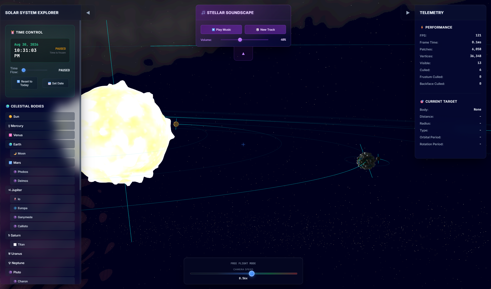

# 🚀 Retro Solar Explorer

**[🌐 Live Demo → cybercyril.com/SolarSystem](https://cybercyril.com/SolarSystem)**

A high-performance, real-time solar system simulation built with WebGL2 and Vite, featuring photorealistic procedural planetary rendering, adaptive Level-of-Detail (LOD) tessellation, and accurate orbital mechanics—all wrapped in a stylish retro sci-fi interface.

---

## ✨ Features

- **🌍 Real-time Planetary Rendering**  
  GPU-accelerated, screen-space tessellated spheres with photorealistic procedural shaders for all major solar system bodies (planets, moons, rings, and the Sun).
- **🎮 Interactive Camera System**  
  Seamlessly switch between free-flight and orbital camera modes, with smooth mouse/touch/keyboard controls.
- **⚡ Performance Optimized**  
  Frustum and backface culling, geometry caching, and adaptive LOD for millions of vertices at 60+ FPS.
- **🌌 Procedural Skybox**  
  Real-time generated starfields, nebulae, and galactic features rendered as a cubemap.
- **📅 Time Control**  
  Accurate orbital mechanics with configurable time acceleration and date setting. Simulate the solar system at any date from 1900 to 2100+.
- **🎵 Dynamic Music**  
  Procedurally generated, evolving synth music with multiple moods and controls.
- **📱 Cross-Platform**  
  Responsive UI and controls for both desktop and mobile devices.
- **🎨 Retro UI**  
  Sci-fi inspired interface with real-time performance metrics, detailed body data, and beautiful panels.

---

## 🛠️ Technical Highlights

- **WebGL2**: Modern graphics pipeline with logarithmic depth buffering for huge scene scales.
- **Adaptive LOD**: Real-time, screen-space tessellation for optimal performance and detail.
- **Smart Culling**: Frustum and backface culling with rotation-aware cache invalidation.
- **Geometry Caching**: Intelligent caching system for smooth real-time interaction.
- **Procedural Shaders**: Custom GLSL shaders for each planet/moon, with unique surface and color features.
- **ES6 Modules & Vite**: Modern JavaScript, fast hot-reload development, and easy builds.

---

## 🚀 Getting Started

### Prerequisites

- Node.js 16+
- Modern browser with WebGL2 support

### Installation

git clone https://github.com/yourusername/retro-solar-explorer
cd retro-solar-explorer
npm install

### Development

npm run dev

Open [http://localhost:5173](http://localhost:5173) in your browser.

### Production Build

npm run build
npm run preview

---

## 📁 Project Structure

retro-solar-explorer/
├── src/
│   ├── app.js               # Main application class
│   ├── main.js              # Entry point
│   ├── core/
│   │   ├── camera.js
│   │   ├── renderer.js
│   │   ├── solarsystem.js
│   │   ├── skybox.js
│   │   ├── audio-manager.js
│   │   └── ...
│   ├── planet_shaders/
│   │   ├── earth-shaders.js
│   │   ├── mars-shaders.js
│   │   └── ...
│   └── style.css
├── index.html
├── package.json
└── vite.config.js

---

## 🎯 Use Cases

- Real-time graphics and WebGL learning
- Astronomy and science education
- Procedural graphics and shader experimentation
- Portfolio and demo projects
- Reference for modern JS/WebGL app architecture

---

## 📊 Performance

- **60+ FPS** on modern hardware
- **Millions of vertices** rendered efficiently
- **Adaptive quality** scaling based on distance
- **Memory efficient** with smart geometry caching
- **Hot reload** development with Vite

---

## 🎮 Controls

- **WASD**: Move camera (free mode)
- **Mouse/Touch drag**: Rotate camera/view
- **Scroll/Pinch**: Zoom (in orbital mode)
- **Number keys (1-9)**: Focus on planets
- **R**: Reset camera to Earth/Sun view
- **Space**: Up (free mode)
- **C**: Down (free mode)
- **Q/E**: Roll left/right (free mode)
- **Panel UI**: Select planets, change time, adjust settings, play/pause music

---

## 🌐 Browser Support

- Chrome 56+
- Firefox 51+
- Safari 15+
- Edge 79+

*Requires WebGL2 support*

---

## ⚠️ Limitations / Notes

- **Procedural surfaces, not true geology**: Terrain and surface features are generated with artistic, physically-inspired noise—these are not real planetary elevation maps.
- **No physical simulation of gravity or collisions**: Orbits are simplified and precomputed for visual accuracy, not for N-body simulation.
- **Audio is procedural, not based on real astronomical data**.

---

## 🏷️ Tags

`webgl2` `vite` `solar-system` `real-time-rendering` `adaptive-lod` `planetary-simulation` `javascript` `graphics-programming` `astronomy` `3d-visualization` `performance-optimization` `es6-modules`

---

## 📄 License

MIT License - see [LICENSE](LICENSE) for details